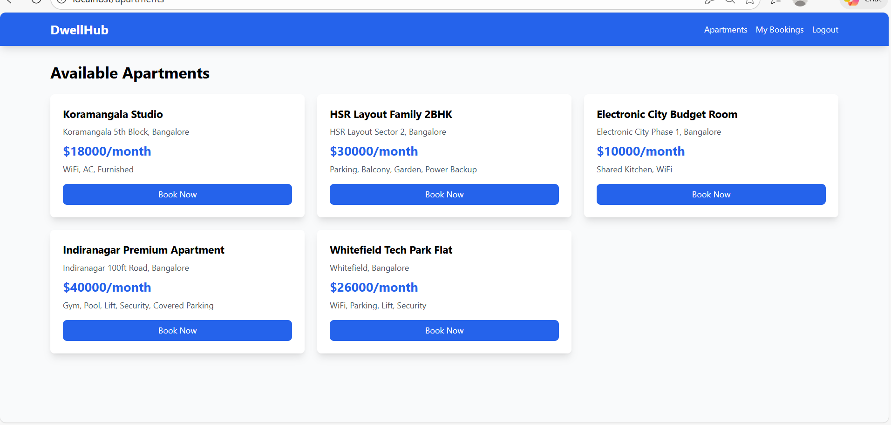
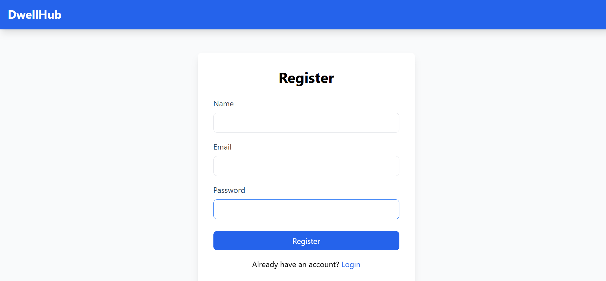
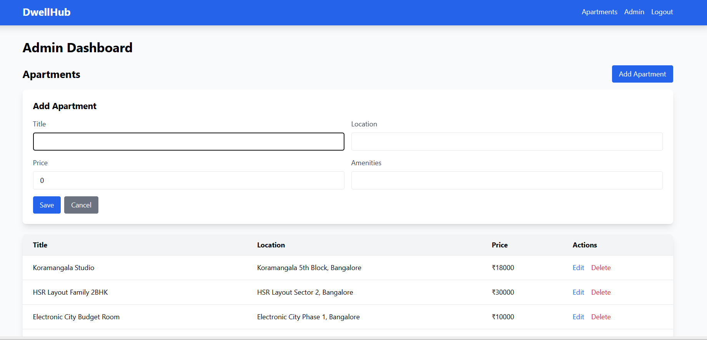

# DwellHub - Residential Apartment Rental Portal

<div align="center">


**A modern, full-stack apartment rental management system with separate portals for residents and administrators**

[Features](#-features) • [Tech Stack](#-tech-stack) • [Getting Started](#-getting-started) • [Demo](#-demo-credentials)

</div>

---

## 📸 Application Screenshots

### 🏠 Home - Available Apartments

*Browse available apartments with detailed information including location, price, and amenities*

### 👤 User Registration

*Secure user registration with form validation*

### 🔐 Admin Dashboard

*Comprehensive admin panel for managing properties and bookings*

---

## 🎯 Project Overview

DwellHub is a comprehensive apartment rental management system that enables users to browse available apartments, request bookings, and track their rental status. Administrators can manage property listings, handle booking requests, and oversee the entire rental process through an intuitive dashboard.

### ✨ Key Highlights

- 🏢 **Property Management** - Complete CRUD operations for apartment listings
- 📅 **Booking System** - Real-time booking requests with approval workflow
- 🔐 **Secure Authentication** - JWT-based authentication with role-based access
- 🎨 **Modern UI** - Responsive design with Tailwind CSS
- 🐳 **Containerized** - Fully Dockerized for consistent deployment
- 💾 **Database Driven** - PostgreSQL with SQLAlchemy ORM

---

## ✨ Features

### 👥 User Portal
- ✅ **User Registration & Login** - Secure account creation with JWT authentication
- 🏘️ **Browse Apartments** - View available apartments with detailed information
- 📝 **Book Apartments** - Submit booking requests with one click
- 📊 **Track Bookings** - Monitor booking status (pending/approved/rejected)
- 🔔 **Real-time Updates** - Get instant status updates on bookings

### 🔧 Admin Portal
- ➕ **Add New Properties** - Create apartment listings with all details
- ✏️ **Edit Properties** - Update existing apartment information
- 🗑️ **Remove Properties** - Delete outdated listings
- 📋 **View All Bookings** - Comprehensive booking management dashboard
- ✅ **Approve/Reject Bookings** - Process booking requests efficiently
- 👨‍💼 **User Management** - Oversee registered users

---

## 🛠️ Tech Stack

### Frontend
| Technology | Purpose |
|-----------|---------|
| **Angular 20** | Component-based SPA framework |
| **TypeScript** | Type-safe JavaScript |
| **Tailwind CSS** | Utility-first CSS framework |
| **RxJS** | Reactive programming library |
| **HTML5** | Semantic markup |

### Backend
| Technology | Purpose |
|-----------|---------|
| **Python Flask** | Lightweight REST API framework |
| **SQLAlchemy** | Python SQL toolkit and ORM |
| **PostgreSQL** | Relational database |
| **PyJWT** | JSON Web Token implementation |
| **Flask-CORS** | Cross-Origin Resource Sharing |

### DevOps
| Technology | Purpose |
|-----------|---------|
| **Docker** | Application containerization |
| **Docker Compose** | Multi-container orchestration |
| **Nginx** | Web server for frontend |

---

## 📁 Project Structure

```
dwellhub/
├── 📂 backend/
│   ├── app.py              # Main Flask application
│   ├── models.py           # Database models (User, Apartment, Booking)
│   ├── config.py           # Configuration settings
│   ├── seed_data.py        # Demo data seeding
│   ├── requirements.txt    # Python dependencies
│   └── Dockerfile          # Backend container configuration
│
├── 📂 frontend/
│   ├── 📂 src/
│   │   ├── 📂 app/
│   │   │   ├── login/         # Login component
│   │   │   ├── register/      # Registration component
│   │   │   ├── apartments/    # Apartment listing
│   │   │   ├── bookings/      # User bookings view
│   │   │   ├── admin/         # Admin dashboard
│   │   │   ├── auth.service.ts    # Authentication service
│   │   │   ├── api.service.ts     # API integration service
│   │   │   └── app.routes.ts      # Application routing
│   │   ├── main.ts            # Application entry point
│   │   └── styles.css         # Global styles
│   ├── angular.json           # Angular configuration
│   ├── package.json           # Node dependencies
│   ├── tailwind.config.js     # Tailwind configuration
│   ├── nginx.conf             # Nginx server configuration
│   └── Dockerfile             # Frontend container configuration
│
├── docker-compose.yml         # Container orchestration
└── README.md                  # Project documentation
```

---

## 🗄️ Database Schema

### Users Table
Stores user credentials and role information

| Column | Type | Description |
|--------|------|-------------|
| `id` | Integer | Primary key |
| `name` | String(100) | User's full name |
| `email` | String(100) | Unique email address |
| `password_hash` | String(200) | Hashed password |
| `role` | String(20) | User role (admin/user) |

### Apartments Table
Contains property listings with complete details

| Column | Type | Description |
|--------|------|-------------|
| `id` | Integer | Primary key |
| `title` | String(200) | Property title |
| `location` | String(200) | Property location |
| `price` | Float | Monthly rent amount |
| `amenities` | String(500) | Available amenities |

### Bookings Table
Manages rental requests and their status

| Column | Type | Description |
|--------|------|-------------|
| `id` | Integer | Primary key |
| `user_id` | Integer | Foreign key to Users |
| `apartment_id` | Integer | Foreign key to Apartments |
| `status` | String(20) | Booking status (pending/approved/rejected) |
| `created_at` | DateTime | Booking creation timestamp |

---

## 🚀 Getting Started

### Prerequisites
- **Docker Desktop** (version 20.10 or higher)
- **Git** for version control
- **4GB RAM** minimum

### Installation & Running

1️⃣ **Clone the repository**
```bash
git clone https://github.com/yourusername/dwellhub.git
cd dwellhub
```

2️⃣ **Start the application**
```bash
docker-compose up --build
```

3️⃣ **Access the application**
- **Frontend:** http://localhost
- **Backend API:** http://localhost:5000

The application will automatically:
- ✅ Set up PostgreSQL database
- ✅ Create necessary tables
- ✅ Seed demo data
- ✅ Start all services

### Stopping the Application

```bash
# Stop containers
docker-compose down

# Stop and remove volumes (fresh start)
docker-compose down -v
```

---

## 👤 Demo Credentials

### Admin Account
```
Email: admin@apartments.com
Password: admin123
```
**Access:** Full admin dashboard with property and booking management

### User Account
```
Email: user@example.com
Password: user123
```
**Access:** Browse apartments and manage personal bookings


## 🔒 Security Features

- 🔐 **Password Hashing** - Using Werkzeug security
- 🎫 **JWT Authentication** - Secure token-based auth
- 👮 **Role-Based Authorization** - Admin vs User access control
- 🌐 **CORS Configuration** - Secure cross-origin requests
- ✅ **Input Validation** - Both frontend and backend validation

---

## 📊 Application Architecture

```
┌─────────────────┐         ┌─────────────────┐         ┌─────────────────┐
│                 │         │                 │         │                 │
│   Angular 20    │         │  Flask + JWT    │         │  PostgreSQL 15  │
│   (Frontend)    │ ◄─────► │   (Backend)     │ ◄─────► │   (Database)    │
│                 │         │                 │         │                 │
│   Port 80       │  HTTP   │   Port 5000     │   SQL   │   Port 5432     │
│   Nginx Server  │  JSON   │   REST API      │  Query  │   Persistent    │
│                 │         │                 │         │                 │
└─────────────────┘         └─────────────────┘         └─────────────────┘
        │                           │                           │
        │                           │                           │
        └───────────────────────────┴───────────────────────────┘
                              Docker Network
```

---

## 🧪 Testing the Application

### Manual Testing Steps

**1. User Registration Flow**
- Navigate to http://localhost/register
- Create a new account with valid credentials
- Verify successful registration message

**2. User Login & Booking**
- Login with user credentials
- Browse available apartments
- Click "Book Now" on any apartment
- Navigate to "My Bookings" to see status

**3. Admin Operations**
- Login with admin credentials
- Navigate to admin dashboard
- Add a new apartment listing
- View all bookings
- Approve or reject pending bookings
- Edit or delete existing apartments

### API Testing with cURL

**Health Check**
```bash
curl http://localhost:5000/api/health
```

**User Registration**
```bash
curl -X POST http://localhost:5000/api/register \
  -H "Content-Type: application/json" \
  -d '{"name":"Test User","email":"test@example.com","password":"test123"}'
```

**User Login**
```bash
curl -X POST http://localhost:5000/api/login \
  -H "Content-Type: application/json" \
  -d '{"email":"user@example.com","password":"user123"}'
```

**Get All Apartments**
```bash
curl http://localhost:5000/api/apartments
```

---

## 🎨 Key Implementation Details

### Authentication Flow
1. User submits login credentials
2. Backend validates credentials against database
3. JWT token generated with user ID and expiration
4. Token stored in localStorage on frontend
5. Token included in Authorization header for protected routes
6. Backend validates token and extracts user information
7. Role-based access control applied based on user role

### State Management
- **Angular Services** for centralized state management
- **RxJS Observables** for reactive data flow
- **HTTP Interceptors** for consistent API communication
- **LocalStorage** for token persistence

### Database Design
- **Normalized Schema** - Eliminates data redundancy
- **Foreign Key Constraints** - Ensures referential integrity
- **Indexed Columns** - Optimizes query performance
- **Automated Seeding** - Provides demo data for development

### Containerization Benefits
- **Consistent Environment** - Same behavior across all machines
- **Easy Deployment** - Single command to start entire stack
- **Isolated Services** - Each service runs in its own container
- **Scalability** - Easy to scale individual services
- **Version Control** - Dockerfile ensures reproducible builds

---

## 📈 Future Enhancements


- [ ] Payment gateway integration
- [ ] Email notifications for booking updates
- [ ] Occupancy analytics dashboard
- [ ] Document upload for verification
- [ ] In-app chat between users and admins
- [ ] Mobile application (React Native)
- [ ] Unit testing and CI/CD pipeline
- [ ] Review and rating system
- [ ] Wishlist/favorites feature

---

## 👥 Contributing

Contributions are welcome! Please follow these steps:

1. Fork the repository
2. Create your feature branch (`git checkout -b feature/AmazingFeature`)
3. Commit your changes (`git commit -m 'Add some AmazingFeature'`)
4. Push to the branch (`git push origin feature/AmazingFeature`)
5. Open a Pull Request

---

## 📝 License

This project is created for educational and portfolio purposes.

---

## 📧 Contact

**Shiwani Raj**  
📧 Email: shiwaniraj203@example.com  
🔗 LinkedIn: https://www.linkedin.com/in/shiwani-raj-1430761b8
🐙 GitHub: https://github.com/shiwaniraj203

**Project Link:** [https://github.com/yourusername/dwellhub](https://github.com/yourusername/dwellhub)

---

## 🎓 Skills Demonstrated

This project showcases proficiency in:

<div align="center">

| Category | Skills |
|----------|--------|
| **Frontend** | Angular 20, TypeScript, RxJS, Tailwind CSS, Responsive Design |
| **Backend** | Python, Flask, REST API Design, SQLAlchemy ORM |
| **Database** | PostgreSQL, Database Design, SQL Queries, Data Modeling |
| **Security** | JWT Authentication, Password Hashing, CORS, Input Validation |
| **DevOps** | Docker, Docker Compose, Containerization, Nginx |
| **Architecture** | MVC Pattern, RESTful Services, Microservices Concepts |
| **Tools** | Git, VS Code, Postman, Docker Desktop |

</div>

